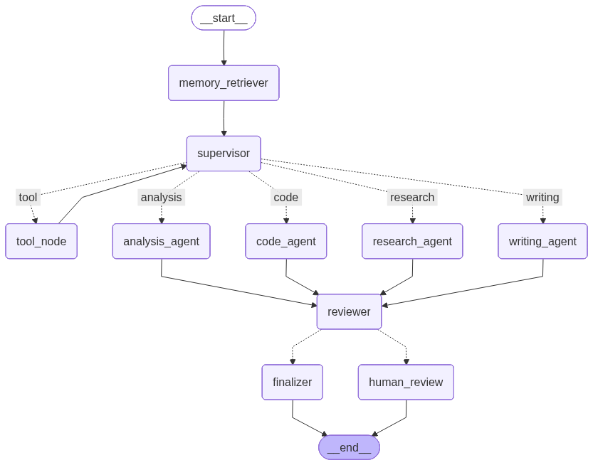

# AgentFlow


AgentFlow is a full-stack multi-agent AI orchestration platform built with FastAPI, LangGraph, React, Vite, Tailwind CSS, SQLite, and pluggable LLM providers. It is designed as a portfolio-ready AI engineering project that demonstrates agent routing, tool use, semantic memory, streaming workflow updates, human review, run history, and production-minded deployment hygiene.

The app has two intentionally separate AI experiences:

- **Run Agent:** a structured LangGraph workflow with memory retrieval, supervisor routing, tool execution, specialist generation, reviewer scoring, and optional human review.
- **Chat Playground:** a direct conversation interface for lightweight model interaction with session history.

## Highlights

- LangGraph workflow with conditional routing and a guarded multi-tool loop.
- Server-Sent Events streaming for node-by-node workflow progress.
- Long-term memory with optional sentence-transformer embeddings and lexical fallback.
- Semantic memory deduplication when embeddings are available.
- Provider abstraction for Groq, OpenAI, and Ollama.
- Per-role model and temperature configuration for chat, supervisor, specialist, reviewer, and memory tasks.
- External research tools through Wikipedia and arXiv, plus safe local utilities.
- Human-in-the-loop review with approve, revise, and reject actions.
- Optional webhook notification when a run enters pending review.
- Workspace-scoped runs and memories using `X-Workspace-Id`.
- Searchable, filterable, paginated run history with JSON export.
- Structured JSON logging, request IDs, retry handling, rate limiting, and SQLite WAL mode.
- React dashboard split into focused tabs and hooks instead of one monolithic app file.

## Workflow

```txt
User Task
   ↓
Memory Retriever
   ↓
Supervisor Agent
   ↓
Tool Loop (0..N, max guarded)
   ↓
Specialist Agent
   ↓
Reviewer Agent
   ↓
Score Check
   ├── High Score → Finalizer → Completed
   └── Low Score  → Human Review → Approve / Revise / Reject
   ↓
Persist Run History
   ↓
Extract Useful Memory
```



## Screenshots

### Dashboard


### Run Agent


### History, Reviews, Memory, and Chat


## Tech Stack

| Area | Tools |
| --- | --- |
| Backend | Python, FastAPI, LangGraph, LangChain, Pydantic, SQLite |
| LLM Providers | Groq, OpenAI, Ollama |
| Frontend | React, Vite, Tailwind CSS |
| Deployment | Render backend, Vercel frontend |
| Quality | Python unittest, Node test runner, ESLint |

## Project Structure

```txt
AgentFlow/
├── render.yaml
├── backend/
│   ├── app/
│   │   ├── agents/          # LangGraph state, graph, workflow nodes
│   │   ├── core/            # Config, logging, rate limiting
│   │   ├── db/              # SQLite connection and schema setup
│   │   ├── repositories/    # Persistence layer
│   │   ├── routers/         # FastAPI routes
│   │   ├── schemas/         # Pydantic request/response models
│   │   ├── services/        # LLM, memory, embeddings, notifications
│   │   └── tools/           # Calculator, text, Wikipedia, arXiv tools
│   ├── tests/
│   ├── requirements.txt
│   ├── requirements-embeddings.txt
│   └── runtime.txt
├── frontend/
│   ├── src/
│   │   ├── components/      # Dashboard tabs and shared UI
│   │   ├── hooks/           # API, chat, history, memory, workflow hooks
│   │   └── lib/             # Constants, formatting, SSE helpers
│   └── package.json
├── docs/
│   ├── agentflow-graph.png
│   └── screenshots/
└── README.md
```

## Local Setup

### Backend

```bash
cd backend
python3 -m venv venv
source venv/bin/activate
pip install -r requirements.txt
cp .env.example .env
```

Set at least one provider key in `backend/.env`:

```env
LLM_PROVIDER=groq
GROQ_API_KEY=your_groq_api_key_here
```

Run the API:

```bash
uvicorn main:app --reload
```

Backend URLs:

- API: `http://127.0.0.1:8000`
- Swagger docs: `http://127.0.0.1:8000/docs`
- Health check: `http://127.0.0.1:8000/health`

Optional semantic embeddings:

```bash
pip install -r requirements-embeddings.txt
```

Without the optional embedding package, AgentFlow still runs and falls back to lexical memory search.

### Frontend

```bash
cd frontend
npm install
cp .env.example .env
npm run dev
```

Set the frontend API URL:

```env
VITE_API_BASE_URL=http://127.0.0.1:8000
```

Frontend URL:

- `http://localhost:5173`

## Environment Variables

Backend:

| Variable | Purpose |
| --- | --- |
| `LLM_PROVIDER` | `groq`, `openai`, or `ollama` |
| `GROQ_API_KEY` | Groq API key when using Groq |
| `OPENAI_API_KEY` | OpenAI API key when using OpenAI |
| `OLLAMA_BASE_URL` | Local Ollama server URL |
| `GROQ_MODEL` / `DEFAULT_LLM_MODEL` | Default model selection |
| `CHAT_MODEL`, `SUPERVISOR_MODEL`, `SPECIALIST_MODEL`, `REVIEWER_MODEL`, `MEMORY_MODEL` | Optional per-role model overrides |
| `*_TEMPERATURE` | Optional per-role temperature overrides |
| `SQLITE_DB_PATH` | SQLite database file path |
| `HUMAN_REVIEW_SCORE_THRESHOLD` | Score below which human review is required |
| `AGENT_MAX_TOOL_ITERATIONS` | Maximum tool-loop passes |
| `REVIEW_WEBHOOK_URL` | Optional webhook for pending review notifications |
| `ALLOWED_ORIGINS` | Comma-separated frontend origins allowed by CORS |
| `ALLOWED_ORIGIN_REGEX` | Optional CORS regex for preview URLs |

Frontend:

| Variable | Purpose |
| --- | --- |
| `VITE_API_BASE_URL` | Public backend URL used by the React app |

Do not commit real `.env` files. This repo intentionally tracks only `.env.example` templates.

## API Overview

| Method | Endpoint | Description |
| --- | --- | --- |
| `GET` | `/health` | Backend health check |
| `POST` | `/chat` | Direct chat endpoint with conversation history |
| `POST` | `/agent/run` | Blocking workflow run |
| `POST` | `/agent/run/stream` | Streaming workflow run through SSE |
| `GET` | `/agent/runs` | Paginated, searchable run history |
| `GET` | `/agent/runs/{run_id}` | Run detail |
| `GET` | `/agent/runs/{run_id}/export` | JSON export for a run |
| `GET` | `/agent/reviews/pending` | Pending human reviews |
| `POST` | `/agent/runs/{run_id}/human-review` | Approve, revise, or reject a run |
| `GET` | `/memory` | List workspace memories |
| `POST` | `/memory` | Add memory |
| `GET` | `/memory/search` | Search memory |
| `DELETE` | `/memory/{memory_id}` | Delete memory |

Workspace-scoped endpoints use:

```txt
X-Workspace-Id: workspace_xxxxx
```

## Deployment

### Render Backend

Create a Render Web Service with:

```txt
Root Directory: backend
Build Command: pip install -r requirements.txt
Start Command: uvicorn main:app --host 0.0.0.0 --port $PORT
```

Set Render environment variables:

```env
ENVIRONMENT=production
LLM_PROVIDER=groq
GROQ_API_KEY=your_real_key
ALLOWED_ORIGINS=https://your-vercel-app.vercel.app
ALLOWED_ORIGIN_REGEX=^https://.*\.vercel\.app$
```

For full semantic embeddings on a larger instance, use this build command instead:

```txt
pip install -r requirements-embeddings.txt
```

SQLite note: Render's free filesystem can be ephemeral. For a portfolio demo this is acceptable, but for durable production data use a persistent Render disk or migrate to Postgres/pgvector.

This repo also includes `render.yaml` as a safe starter blueprint. It marks `GROQ_API_KEY` and `ALLOWED_ORIGINS` as dashboard-provided values, so secrets are not committed.

### Vercel Frontend

Create a Vercel project with:

```txt
Root Directory: frontend
Framework Preset: Vite
Build Command: npm run build
Output Directory: dist
```

Set Vercel environment variables:

```env
VITE_API_BASE_URL=https://your-render-service.onrender.com
```

After Vercel deploys, add the Vercel domain to the Render backend `ALLOWED_ORIGINS`.

The frontend also includes `frontend/vercel.json` with the Vite build and output settings.

## Verification

Backend:

```bash
cd backend
source venv/bin/activate
python -m unittest discover -s tests -v
python -m compileall app main.py
```

Frontend:

```bash
cd frontend
npm run lint
npm test
npm run build
```

## Public Repo Safety Checklist

- Real `.env` files are ignored.
- Local SQLite databases and WAL/SHM files are ignored.
- `node_modules`, `dist`, Python caches, logs, and local tool folders are ignored.
- Only `.env.example` files are committed.
- Production CORS should be restricted to the deployed Vercel domain.
- API keys should be rotated immediately if they were ever shared in a terminal, screenshot, chat, or commit.

## Portfolio Talking Points

- This is not just a chatbot; it is a stateful agent workflow with routing, tools, memory, review, and traceability.
- The frontend separates direct chat from structured agent execution, making the product mental model clearer.
- The backend demonstrates practical production concerns: retries, rate limiting, streaming, logging, CORS, workspace scoping, and deployment hygiene.
- The architecture is intentionally compact enough for a portfolio project while leaving clear upgrade paths to auth, Postgres/pgvector, queues, and hosted observability.

## Author

Built by **Jatin Shukla**.
