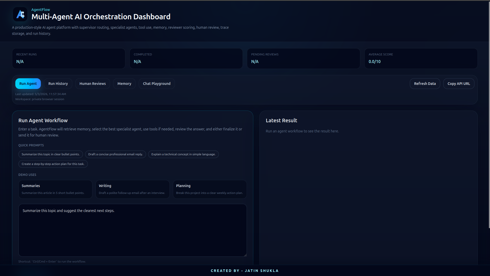
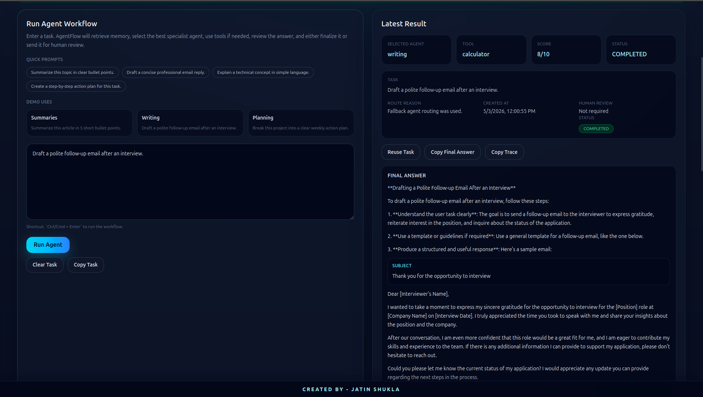
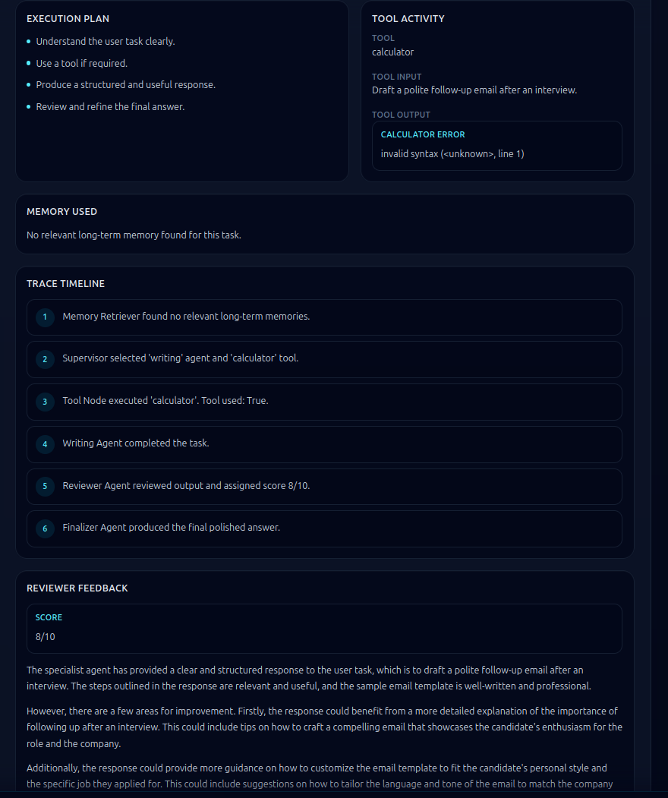
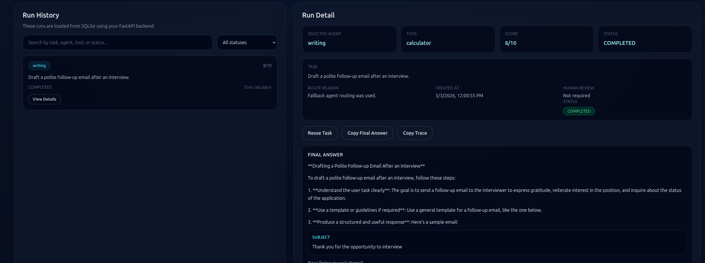
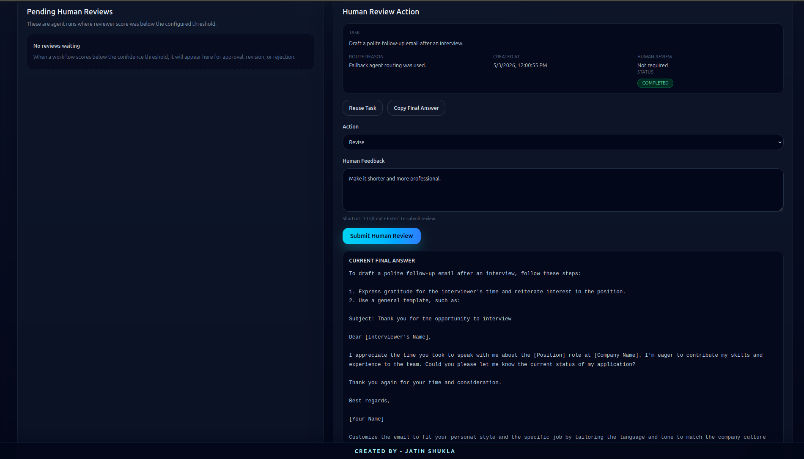
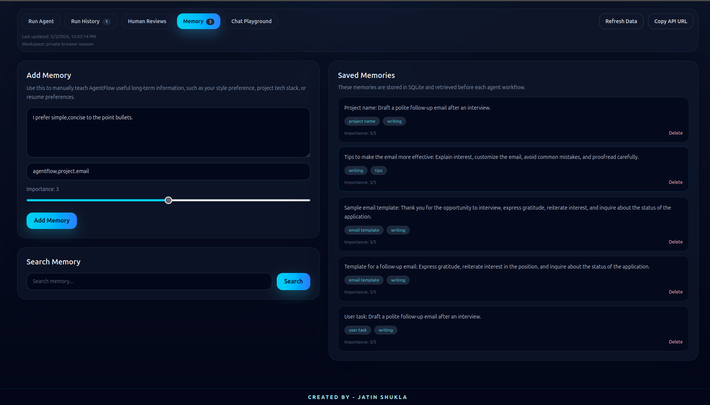
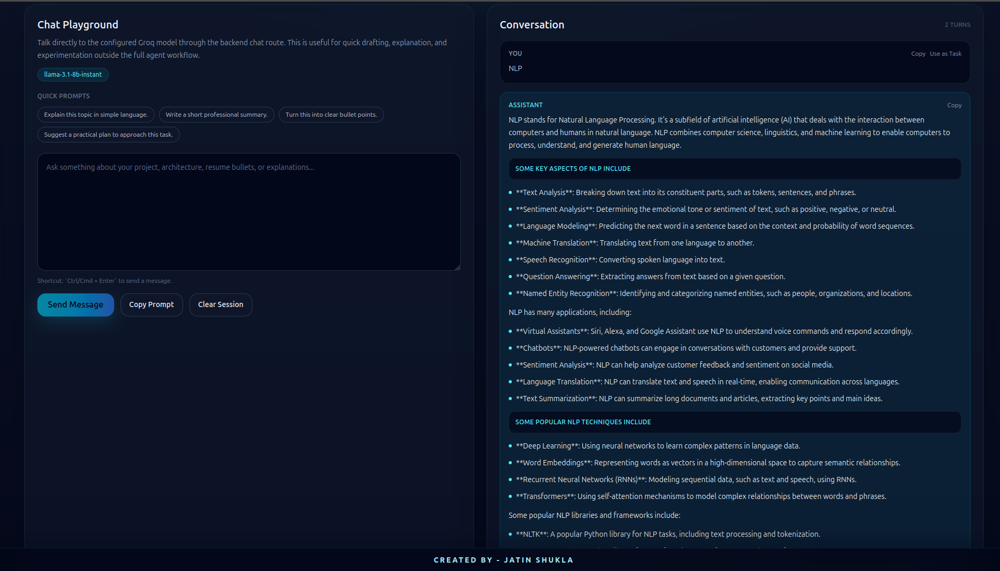

# AgentFlow — Multi-Agent AI Orchestration Platform


AgentFlow is a full-stack **multi-agent AI orchestration platform** built with **FastAPI, LangGraph, Groq, React, SQLite, Vite, and Tailwind CSS**.

It provides a polished AI workflow dashboard where users can run supervisor-led agent tasks, use a direct **Chat Playground**, manage long-term memory, review low-confidence outputs, inspect execution traces, search/filter workflow history, and work inside browser-specific isolated workspaces for safer public deployment.

This project is built to showcase practical **AI engineering**, **agentic AI**, **human-in-the-loop AI**, and **full-stack GenAI system design** skills beyond a basic chatbot.

---

## Live Demo

- **Frontend App:** https://agent-flow-five-phi.vercel.app
- **Backend API:** https://agentflow-mlmp.onrender.com

---

## Features at a Glance

- LangGraph-based multi-agent workflow
- Supervisor-led specialist agent routing
- Research, Code, Writing, and Analysis agents
- Backend tool registry
- Long-term memory management
- Browser-specific workspace isolation
- Workspace-scoped run history and memory
- Reviewer scoring and quality checks
- Human-in-the-loop approve/revise/reject workflow
- Trace timeline for workflow observability
- Chat Playground for direct LLM interaction
- Searchable and filterable run history
- Overview dashboard stats
- Copy and reuse productivity actions
- Polished React + Tailwind dashboard
- Render + Vercel deployment-ready setup

---

## Why I Built This

Most AI applications stop at a single LLM call:

```txt
User → LLM → Response
```

But real AI systems need more than that. Production-level AI applications often require:

- Task planning
- Agent routing
- Tool execution
- Memory retrieval
- Output review
- Human approval
- Workspace-level data isolation
- Run history
- Traceability
- Observability

AgentFlow was built to simulate a realistic AI agent platform where every task goes through a controlled workflow.

```txt
User Task
   ↓
Memory Retriever
   ↓
Supervisor Agent
   ↓
Tool Node
   ↓
Specialist Agent
   ↓
Reviewer Agent
   ↓
Score Check
   ├── High Score → Finalizer Agent → Completed
   └── Low Score  → Human Review → Approve / Revise / Reject
   ↓
Save Workspace-Scoped Run History
   ↓
Extract Useful Memory
```

---

## What Makes This Different From a Basic Chatbot

Most chatbot projects follow this pattern:

```txt
User Prompt → LLM → Response
```

AgentFlow follows a more production-style workflow:

```txt
User Task
→ Workspace Identification
→ Memory Retrieval
→ Supervisor Routing
→ Tool Execution
→ Specialist Agent Execution
→ Reviewer Scoring
→ Human Review or Finalizer
→ Trace Storage
→ Workspace-Scoped History and Memory
```

This demonstrates:

- Agent orchestration
- State-based workflow design
- Quality control
- Human approval
- Memory-aware generation
- Workspace data isolation
- Full-stack AI product thinking
- Practical AI engineering beyond simple LLM wrappers

---

## Key Features

### Multi-Agent Workflow

AgentFlow uses a supervisor-led multi-agent workflow where every task is routed to the most suitable specialist agent.

Specialist agents include:

- **Research Agent** — explains, compares, summarizes, and provides concept-level answers
- **Code Agent** — handles coding, debugging, backend/frontend architecture, and implementation tasks
- **Writing Agent** — creates resume bullets, LinkedIn posts, emails, captions, and documentation
- **Analysis Agent** — handles decision-making, trade-offs, recommendations, and problem breakdowns

---

### Supervisor Agent Routing

The Supervisor Agent analyzes the user task and decides:

- Which specialist agent should handle the task
- Whether a backend tool is required
- What execution plan should be followed

Example:

```txt
Task: Create resume bullets for my AI project
Selected Agent: Writing Agent

Task: Write a FastAPI endpoint
Selected Agent: Code Agent

Task: Compare RAG and fine-tuning
Selected Agent: Research Agent
```

---

### Tool Registry

AgentFlow includes a backend tool registry that allows the workflow to use deterministic tools instead of relying only on LLM text generation.

Current tools:

| Tool | Purpose |
|---|---|
| Calculator Tool | Performs safe arithmetic calculations |
| Text Statistics Tool | Counts words, characters, sentences, and lines |
| Keyword Extractor Tool | Extracts important terms and ATS-style keywords |

This makes the project closer to a real agentic system because the LLM can decide when to use external tools, while the backend executes those tools safely and deterministically.

---

### Long-Term Memory

AgentFlow stores useful memories in SQLite and retrieves relevant context before every workflow run.

Memory can store:

- User preferences
- Project details
- Tech stack information
- Writing style preferences
- Resume preferences
- Long-term reusable context

Example memory:

```txt
User prefers simple, professional, human-sounding resume bullets with measurable impact.
```

When the user later asks for resume bullets, AgentFlow retrieves this memory and uses it during planning and generation.

---

### Reviewer Agent

After a specialist agent completes the task, a Reviewer Agent evaluates the output.

It checks:

- Clarity
- Completeness
- Correctness
- Usefulness
- Alignment with the original task

The reviewer assigns a score from `1` to `10`.

Example:

```txt
Score: 8/10

The answer is clear and useful, but it can be improved by adding stronger technical keywords and measurable impact.
```

---

### Human-in-the-Loop Review

If the reviewer score is below the configured threshold, AgentFlow pauses the workflow and marks it for human review.

A human reviewer can:

- **Approve** the output
- **Revise** the output with feedback
- **Reject** the output

This adds a production-style safety and quality-control layer.

Example human review request:

```json
{
  "action": "revise",
  "feedback": "Make the answer shorter, more professional, and more resume-friendly."
}
```

---

### Chat Playground

AgentFlow includes a separate **Chat Playground** connected to the `/chat` backend endpoint.

Users can:

- Send general chat prompts
- Use prompt suggestions and demo examples
- View session-style chat history
- See the active model badge
- Copy individual chat messages
- Reuse user chat messages as agent tasks
- Clear the chat session
- Use `Ctrl/Cmd + Enter` to send messages

This provides a lightweight direct LLM interaction layer alongside the structured multi-agent workflow.

The Chat Playground is intentionally separate from `/agent/run`:

```txt
/chat      → Direct LLM interaction
/agent/run → Full structured multi-agent workflow
```

---

### Workspace Isolation

AgentFlow supports browser-specific workspaces using a workspace ID stored in `localStorage`.

When a user opens the app, the frontend creates or loads a workspace ID and sends it with scoped API requests:

```txt
X-Workspace-Id: workspace_xxxxx
```

The backend uses this workspace ID to isolate:

- Agent runs
- Run history
- Pending reviews
- Memory list
- Memory search
- Memory deletion
- Memory extraction from completed runs

This prevents different deployed users from seeing each other’s data in the public demo.

> This is not full authentication. It is a practical workspace isolation layer for public portfolio deployment. For production SaaS usage, it should be replaced with authenticated user accounts and role-based access control.

---

### Trace History and Observability

Every workflow run is saved with detailed trace information.

Each run stores:

- Original task
- Retrieved memory
- Selected agent
- Tool used
- Tool result
- Reviewer score
- Final status
- Human review decision
- Final answer
- Trace timeline

Example trace:

```txt
1. Memory Retriever found 2 relevant long-term memories.
2. Supervisor selected 'writing' agent and 'none' tool.
3. Tool Node skipped because no tool was needed.
4. Writing Agent completed the task.
5. Reviewer Agent reviewed output and assigned score 8/10.
6. Finalizer Agent produced the final polished answer.
```

This helps debug agent decisions and makes the system observable.

---

## Screenshots

### Dashboard


### Run Agent




### Run History


### Human Reviews


### Memory


### Chat Playground



## Tech Stack

### Backend

| Technology | Purpose |
|---|---|
| Python | Backend programming language |
| FastAPI | API development |
| LangGraph | Multi-agent workflow orchestration |
| LangChain | LLM integration layer |
| Groq | LLM inference provider |
| SQLite | Local database for runs and memory |
| Pydantic | Request and response validation |
| Uvicorn | ASGI server |

### Frontend

| Technology | Purpose |
|---|---|
| React | Frontend UI |
| Vite | Frontend build tool |
| Tailwind CSS | Styling |
| JavaScript | UI logic |
| localStorage | Browser workspace ID storage |

### Deployment

| Platform | Purpose |
|---|---|
| Render | Backend deployment |
| Vercel | Frontend deployment |
| GitHub Actions | Optional CI checks |

---

## System Architecture

```txt
Frontend Dashboard
├── Workspace ID Manager
│   └── Stores browser-specific workspace_id in localStorage
│
├── Run Agent Tab
│   ├── Submit task
│   ├── Demo workflow examples
│   ├── View final answer
│   ├── View execution plan
│   ├── View tool activity
│   ├── View memory used
│   ├── View reviewer feedback
│   └── View trace timeline
│
├── Chat Playground Tab
│   ├── Direct chat with /chat endpoint
│   ├── Session-style chat history
│   ├── Prompt suggestions
│   ├── Model badge display
│   └── Reuse chat prompts as agent tasks
│
├── Run History Tab
│   ├── Search runs
│   ├── Filter by status
│   ├── View selected run detail
│   └── Reuse previous tasks
│
├── Human Reviews Tab
│   ├── View pending reviews
│   ├── Approve output
│   ├── Revise output
│   ├── Reject output
│   └── Copy/reuse review content
│
└── Memory Tab
    ├── Add memory
    ├── Search memory
    ├── Delete memory with confirmation
    └── View workspace-specific memories
```

```txt
Backend API
├── FastAPI Routers
├── CORS Middleware
├── Workspace Header Handling
├── LangGraph Agent Workflow
├── LLM Service
├── Tool Registry
├── Memory Service
├── Human Review Service
├── SQLite Repository Layer
└── Database Initialization
```

---

## Agent Workflow Architecture

```txt
User opens app
   ↓
Frontend creates or loads workspace_id from localStorage
   ↓
User submits task
   ↓
Frontend sends POST /agent/run with X-Workspace-Id
   ↓
Backend receives task + workspace_id
   ↓
Memory Retriever searches workspace-specific memory
   ↓
Supervisor Agent selects specialist agent and tool
   ↓
Tool Node executes backend tool if needed
   ↓
Specialist Agent generates output
   ↓
Reviewer Agent scores output
   ↓
Score Check
   ├── score >= threshold → Finalizer Agent
   └── score < threshold  → Human Review Node
   ↓
Run saved with workspace_id
   ↓
Useful memory extracted and saved with workspace_id
   ↓
Frontend displays structured result
```

---

## Project Structure

```txt
AgentFlow/
├── backend/
│   ├── app/
│   │   ├── agents/
│   │   │   ├── agent_graph.py
│   │   │   ├── agent_state.py
│   │   │   └── workflow_nodes.py
│   │   │
│   │   ├── core/
│   │   │   └── config.py
│   │   │
│   │   ├── db/
│   │   │   └── database.py
│   │   │
│   │   ├── repositories/
│   │   │   ├── agent_run_repository.py
│   │   │   └── memory_repository.py
│   │   │
│   │   ├── routers/
│   │   │   ├── agent_router.py
│   │   │   ├── chat_router.py
│   │   │   └── memory_router.py
│   │   │
│   │   ├── schemas/
│   │   │   ├── agent_schema.py
│   │   │   ├── chat_schema.py
│   │   │   └── memory_schema.py
│   │   │
│   │   ├── services/
│   │   │   ├── human_review_service.py
│   │   │   ├── llm_service.py
│   │   │   └── memory_service.py
│   │   │
│   │   └── tools/
│   │       └── tool_registry.py
│   │
│   ├── main.py
│   ├── requirements.txt
│   ├── runtime.txt
│   ├── .env.example
│   └── README.md
│
├── frontend/
│   ├── public/
│   │   └── favicon / logo assets
│   │
│   ├── src/
│   │   ├── assets/
│   │   ├── App.jsx
│   │   ├── index.css
│   │   └── main.jsx
│   │
│   ├── package.json
│   ├── vite.config.js
│   ├── .env.example
│   └── README.md
│
├── docs/
│   ├── architecture.md
│   ├── api-reference.md
│   ├── deployment.md
│   └── screenshots/
│       ├── dashboard.png
│       ├── dashboard-overview.png
│       ├── agent-run.png
│       ├── agent-run-result.png
│       ├── trace-timeline.png
│       ├── history.png
│       ├── history-search-filter.png
│       ├── human-review.png
│       ├── memory.png
│       ├── memory-management.png
│       ├── chat-playground.png
│       └── api-docs.png
│
├── .github/
│   └── workflows/
│       ├── backend-check.yml
│       └── frontend-check.yml
│
├── README.md
├── .gitignore
├── LICENSE
└── CONTRIBUTING.md
```

---

## Local Setup

### Prerequisites

Make sure you have:

- Python 3.11+
- Node.js 20+
- npm
- Git
- Groq API key

---

## Backend Setup

Go to backend folder:

```bash
cd backend
```

Create virtual environment:

```bash
python3 -m venv venv
source venv/bin/activate
```

Install dependencies:

```bash
pip install -r requirements.txt
```

Create `.env` file:

```bash
cp .env.example .env
```

Update `.env`:

```env
APP_NAME=AgentFlow
APP_VERSION=0.1.0
ENVIRONMENT=development

GROQ_API_KEY=your_groq_api_key_here
GROQ_MODEL=llama-3.1-8b-instant

SQLITE_DB_PATH=agentflow.db
HUMAN_REVIEW_SCORE_THRESHOLD=7

ALLOWED_ORIGINS=http://localhost:5173,http://localhost:5174,http://127.0.0.1:5173,http://127.0.0.1:5174
```

Run backend:

```bash
uvicorn main:app --reload
```

Backend will run at:

```txt
http://127.0.0.1:8000
```

Swagger API docs:

```txt
http://127.0.0.1:8000/docs
```

Health check:

```txt
http://127.0.0.1:8000/health
```

---

## Frontend Setup

Go to frontend folder:

```bash
cd frontend
```

Install dependencies:

```bash
npm install
```

Create `.env` file:

```bash
cp .env.example .env
```

Update `.env`:

```env
VITE_API_BASE_URL=http://127.0.0.1:8000
```

Run frontend:

```bash
npm run dev
```

Frontend will run at:

```txt
http://localhost:5173
```

If port `5173` is already in use, Vite may run on `5174`. That is okay. Just make sure backend CORS allows that port.

---

## Environment Variables

### Backend `.env.example`

```env
APP_NAME=AgentFlow
APP_VERSION=0.1.0
ENVIRONMENT=development

GROQ_API_KEY=your_groq_api_key_here
GROQ_MODEL=llama-3.1-8b-instant

SQLITE_DB_PATH=agentflow.db
HUMAN_REVIEW_SCORE_THRESHOLD=7

ALLOWED_ORIGINS=http://localhost:5173,http://localhost:5174,http://127.0.0.1:5173,http://127.0.0.1:5174
```

### Frontend `.env.example`

```env
VITE_API_BASE_URL=http://127.0.0.1:8000
```

---

## API Endpoints

### Health

| Method | Endpoint | Workspace Scoped | Description |
|---|---|---|---|
| GET | `/health` | No | Check backend health |
| GET | `/` | No | Root API information |

---

### Chat

| Method | Endpoint | Workspace Scoped | Description |
|---|---|---|---|
| POST | `/chat` | No | Direct LLM chat endpoint used by Chat Playground |

Example request:

```json
{
  "message": "Explain AI agents in simple words."
}
```

Example response:

```json
{
  "response": "AI agents are...",
  "model": "llama-3.1-8b-instant"
}
```

---

### Agent Workflow

| Method | Endpoint | Workspace Scoped | Description |
|---|---|---|---|
| POST | `/agent/run` | Yes | Run full AgentFlow workflow |
| GET | `/agent/runs` | Yes | Get recent workflow runs for the workspace |
| GET | `/agent/runs/{run_id}` | Yes | Get one workflow run detail from the workspace |
| GET | `/agent/reviews/pending` | Yes | Get runs waiting for human review |
| POST | `/agent/runs/{run_id}/human-review` | Yes | Submit human review action |

Example request:

```json
{
  "task": "Create 3 resume bullets for AgentFlow project."
}
```

Example response fields:

```json
{
  "run_id": "uuid",
  "task": "Create 3 resume bullets for AgentFlow project.",
  "retrieved_memories": [],
  "memory_context": "No relevant long-term memory found for this task.",
  "selected_agent": "writing",
  "route_reason": "The task requires professional resume writing.",
  "tool_name": "none",
  "tool_used": false,
  "score": 8,
  "status": "COMPLETED",
  "needs_human_review": false,
  "final_answer": "...",
  "trace": []
}
```

---

### Human Review

Example request:

```json
{
  "action": "revise",
  "feedback": "Make the answer shorter, more professional, and more resume-friendly."
}
```

Allowed actions:

```txt
approve
revise
reject
```

---

### Memory

| Method | Endpoint | Workspace Scoped | Description |
|---|---|---|---|
| POST | `/memory` | Yes | Add memory manually |
| GET | `/memory` | Yes | List saved memories for the workspace |
| GET | `/memory/search?query=...` | Yes | Search workspace memories |
| DELETE | `/memory/{memory_id}` | Yes | Delete a workspace memory |

Example memory request:

```json
{
  "content": "User prefers simple resume bullets with measurable impact.",
  "tags": ["resume", "preference"],
  "importance": 5
}
```

---

## Example Usage

### Add Memory

```json
{
  "content": "AgentFlow is a multi-agent AI orchestration project built using FastAPI, LangGraph, Groq, SQLite, tools, memory, human review, and React.",
  "tags": ["agentflow", "project", "tech-stack"],
  "importance": 5
}
```

### Run Agent Workflow

```json
{
  "task": "Create 3 strong resume bullets for AgentFlow project."
}
```

### Submit Human Review

```json
{
  "action": "revise",
  "feedback": "Make it more concise and add stronger AI engineering keywords."
}
```

### Use Chat Playground

```json
{
  "message": "Explain the AgentFlow architecture in simple words."
}
```

---

## Frontend Dashboard

The React dashboard provides a complete interface for interacting with AgentFlow.

### Dashboard Overview

Shows:

- Recent run count
- Completed run count
- Pending review count
- Average reviewer score
- Last updated time
- API URL copy action

### Run Agent

Used to:

- Submit agent tasks
- Use demo workflow examples
- Clear and copy tasks
- Run with `Ctrl/Cmd + Enter`
- View structured results
- View final answer
- View execution plan
- View tool activity
- View memory used
- View trace timeline
- View reviewer feedback
- Copy final answer
- Copy trace timeline
- Reuse tasks from previous results

### Chat Playground

Used to:

- Send direct chat messages to the `/chat` endpoint
- Use prompt suggestions
- View session-style chat history
- See model badge display
- Copy individual messages
- Reuse chat prompts as agent tasks
- Clear chat session
- Send using `Ctrl/Cmd + Enter`

### Run History

Used to:

- View previous workflow runs saved in SQLite
- Search run history
- Filter history by status
- Highlight selected run
- View detailed run data
- Reuse previous tasks

### Human Reviews

Used to:

- View pending low-confidence outputs
- Approve output
- Revise output with feedback
- Reject output
- Copy final answer
- Reuse task

### Memory

Used to:

- Add memory manually
- Search memory
- View saved memory
- Delete memory with confirmation
- See improved empty states for no memories or no search results

---

## Deployment

### Backend Deployment on Render

Create a new Render Web Service.

Use these settings:

```txt
Root Directory: backend
Build Command: pip install -r requirements.txt
Start Command: uvicorn main:app --host 0.0.0.0 --port $PORT
```

Add these environment variables in Render:

```env
APP_NAME=AgentFlow
APP_VERSION=0.1.0
ENVIRONMENT=production

GROQ_API_KEY=your_groq_api_key_here
GROQ_MODEL=llama-3.1-8b-instant

SQLITE_DB_PATH=agentflow.db
HUMAN_REVIEW_SCORE_THRESHOLD=7

ALLOWED_ORIGINS=https://your-vercel-frontend-url.vercel.app
```

After deployment, test:

```txt
https://your-render-backend-url.onrender.com/health
```

Swagger docs:

```txt
https://your-render-backend-url.onrender.com/docs
```

---

### Frontend Deployment on Vercel

Create a new Vercel project.

Use these settings:

```txt
Root Directory: frontend
Framework Preset: Vite
Build Command: npm run build
Output Directory: dist
```

Add this environment variable in Vercel:

```env
VITE_API_BASE_URL=https://your-render-backend-url.onrender.com
```

After deployment, update Render backend `ALLOWED_ORIGINS` with your Vercel frontend URL.

Example:

```env
ALLOWED_ORIGINS=https://agentflow.vercel.app
```

For local + production:

```env
ALLOWED_ORIGINS=http://localhost:5173,http://localhost:5174,https://agentflow.vercel.app
```

---

## Note About SQLite

This project currently uses SQLite for simplicity and beginner-friendly local development.

SQLite is good for:

- Local development
- Portfolio demo
- Simple run history
- Learning database persistence

For production deployment, PostgreSQL or Supabase is recommended because free hosting platforms may not persist SQLite files permanently after restarts or redeployments.

Recommended future upgrade:

```txt
SQLite → PostgreSQL / Supabase
```

---

## Privacy and Workspace Isolation

AgentFlow includes browser-level workspace isolation to make deployed usage safer.

When a user opens the app, the frontend creates a workspace ID and stores it in browser `localStorage`.

Example:

```txt
workspace_abc123
```

Every scoped API request includes:

```txt
X-Workspace-Id: workspace_abc123
```

The backend stores this workspace ID with runs and memories.

This ensures:

- User A sees only User A's run history
- User B sees only User B's memories
- Pending reviews are workspace-specific
- Memory extraction does not leak across users
- Deployed demo users do not share the same global history

---

## Suggested Tech Stack Line

```txt
Python, FastAPI, LangGraph, LangChain, Groq, React, Vite, Tailwind CSS, SQLite, Pydantic, Render, Vercel
```

---

## Author

Built by **Jatin Shukla**.

---